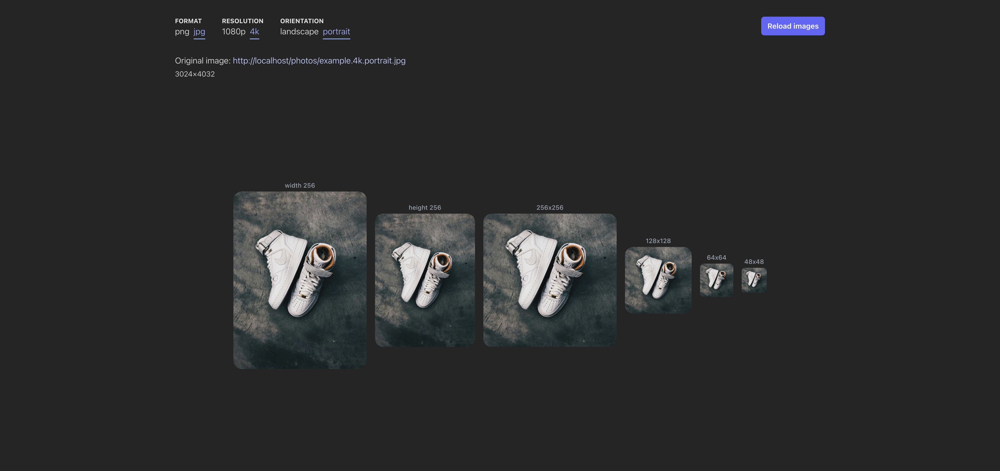

# Nginx image resize demo

The demo shows how to work the image_filter module for Nginx.

## Run locally

1. `git clone git@github.com:Eseath/nginx-image-resize-demo.git`
2. `docker compose up -d`
3. http://localhost:5175

## Resources

### Tech

- https://nginx.org/en/docs/http/ngx_http_image_filter_module.html
- https://pushorigin.ru/nginx/resize-image

### Photos

- https://unsplash.com/photos/pair-of-white-nike-high-top-shoes-SxAXphIPWeg
- https://unsplash.com/photos/black-and-white-new-balance-low-top-sneaker-6zO5VKogoZE
- https://unsplash.com/photos/a-cat-laying-on-a-couch-in-front-of-a-window-kGR0GAZ4Z3s
- https://unsplash.com/photos/a-close-up-of-the-front-seats-of-a-polaris-rzr-xp4-KLWMleAATuY
- https://wallhaven.cc/w/72zvd3
- https://wallhaven.cc/w/jx762y
- https://wallhaven.cc/w/jxo8yp
